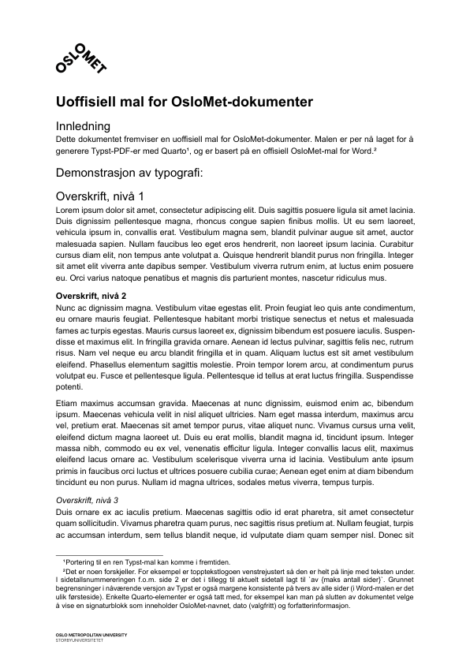
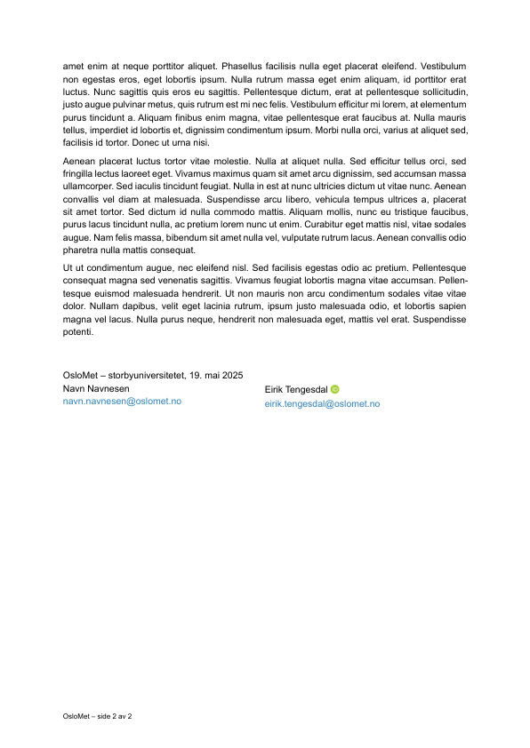

# OsloMet Document Template (Quarto>Typst)
This is an unofficial Quarto template that allows you to create generic OsloMet documents. As of now, it is designed to generate Typst PDFs, and is inspired by an official OsloMet template for Microsoft Word.

In the future, additional templates might be added (and organised along the lines of [https://github.com/quarto-ext/typst-templates](https://github.com/quarto-ext/typst-templates)), and a port to Typst might also be created.

The template has been tailored for Norwegian.

## Installation
### Option (1): Install the template for new documents

You can use this extension as a template to create a new document. Use the following command in your terminal (e.g., in RStudio):

```bash
quarto use template et-templates/oslomet-document
```

This will install the format extension and create an example QMD file
that you can use as a starting place for your document.

### Option (2): Add the template for existing documents

```bash
quarto add et-templates/oslomet-document
```

### Other installation options
You could alternatively install the template with a URL or a local file. For instructions and more, see:

- [Managing Extensions](https://quarto.org/docs/extensions/managing.html)
- [Distributing Extensions](https://quarto.org/docs/extensions/distributing.html)

## Usage

Add your contents as desired in the QMD file below the YAML field.

### YAML header

The YAML should include at least `title` and `format` fields. The example below illustrates this. Various options and more are described in the sections below.

```yaml
---
title: Uoffisiell mal for OsloMet-dokumenter

format:
  document-typst: default
---
```

#### More options in YAML
##### Author information
You can control more options in the YAML header. For example, you can set author information for the signature grid on the last page. The `email` and `orcid` fields for any `name` are optional. The email will be linked to the name in the PDF, and the ORCID iD will be linked to the name in the PDF as well.

```yaml
---
authors:
  - name: Navn Navnesen
    email: navn.navnesen@oslomet.no
  - name: Eirik Tengesdal
    email: eirik.tengesdal@oslomet.no
    orcid: 0000-0003-0599-8925
---
```

##### Dates and date formatting
By default, the current date is inserted by Typst, with the format `DD.MM.YYYY` (`datetime.today().display("[day].[month].[year]")`). If you wish to keep today's date but alter its formatting, you can simply specify this with any custom formatting pattern string supported by [Typst's datetime formatting](https://typst.app/docs/reference/foundations/datetime/), e.g.:

```yaml
---
date-format-typst: "[year]-[month]-[day]"
---
```

If you wish to specify the date manually, you can enter a date in the (Quarto's) YAML `date` field. If it is a date, then it should be formatted as `YYYY-MM-DD`.

Should you wish to alter this date formatting, you must then also specify the desired formatting in the `date-format` field. You can set it to any format supported by [Quarto's date formatting](https://quarto.org/docs/reference/dates.html). This might necessitate specifying `lang` as well.

```yaml
---
date: 2025-05-19
date-format: "D. MMM YYYY"
lang: nb
---
```

##### Hiding the signature or some of its elements
You can hide the signature altogether:

```yaml
---
hide-signature: true
---
```

Alternatively, if you want to keep the signature but hide the default date inserted in the signature, you can specify:

```yaml
---
hide-date: true
---
```

## Example PDF
View an example of the output [PDF](example.pdf) below:

<!-- PDF-TO-MARKDOWN:START -->




<!-- PDF-TO-MARKDOWN:END -->

## Licence and copyright
[](https://opensource.org/licenses/MIT)

© 2025 Eirik Tengesdal

Licensed under the [MIT License](LICENSE).

OsloMet's logo is not licensed under the MIT License. Any usage must be in line with [OsloMet's guidelines](https://ansatt.oslomet.no/en/web/tilsatt/logo-visual-profile). The two logo files (header and footer) in this template repository are based on OsloMet's black logo for usage in digital interfaces. For terms and conditions that apply, see [the logo's information page](https://oslomet.fotoware.cloud/fotoweb/archives/5005-OsloMet-logo/Folder%2052/OsloMet_logo_svart_OsloMet.svg.info) and [OsloMet's visual profile guidelines](https://ansatt.oslomet.no/en/web/tilsatt/logo-visual-profile). 

## Contact
Eirik Tengesdal<br />
Assistant Professor of Norwegian<br />
Department of Early Childhood Education (BLU)<br />
OsloMet – Oslo Metropolitan University<br />
eirik.tengesdal@oslomet.no

Guest Researcher of Linguistics<br />
Department of Linguistics and Scandinavian Studies (ILN)<br />
University of Oslo<br />
eirik.tengesdal@iln.uio.no

 [0000-0003-0599-8925](https://orcid.org/0000-0003-0599-8925)<br />
https://eiriktengesdal.no/
